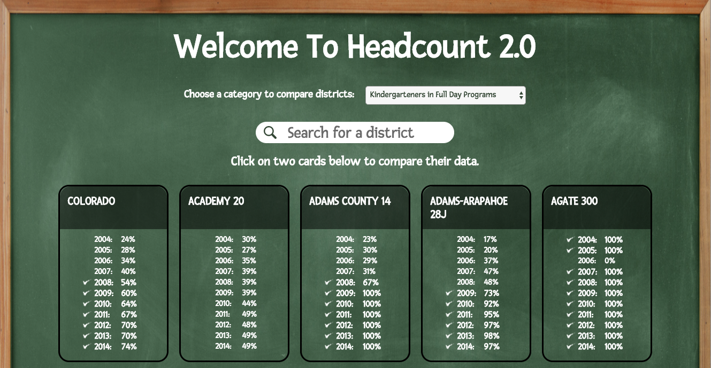
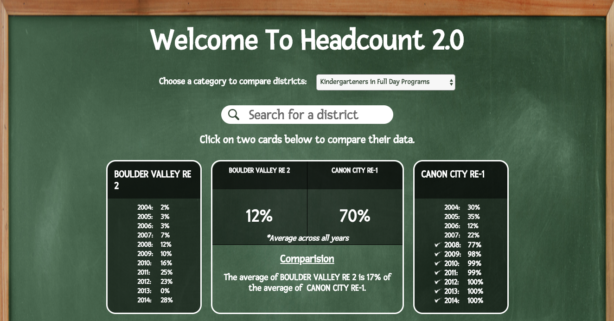

# HeadCount 2.0

## Overview 

HeadCount is an application that allows the user to compare educational stats from districts within Colorado by year, per district. This project was designed to improve our skills at manipulating data and creating small, reusable React components. The goals of the project were to separate application logic into small, testable functions and to write meaningful unit and integration tests. The team members on this project were Maddy Dannenberg, Jared Eklin and Michael Gatewood.

